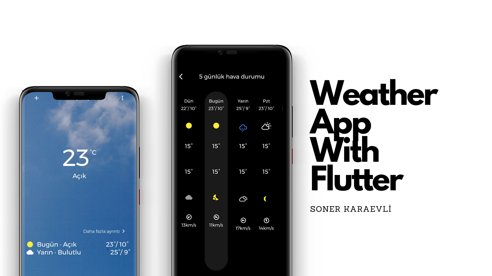
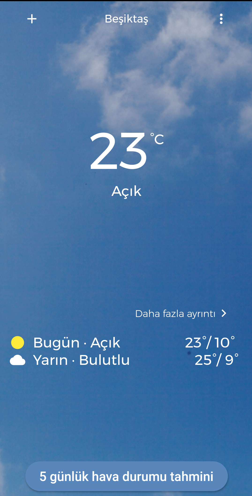
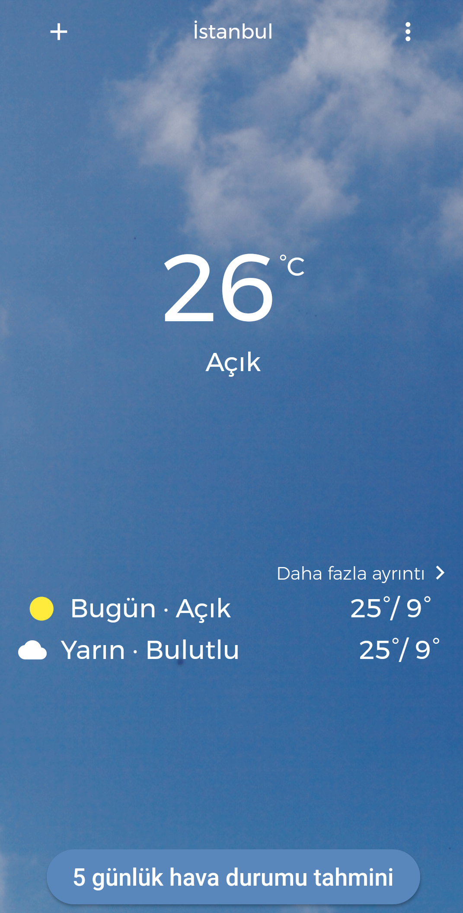
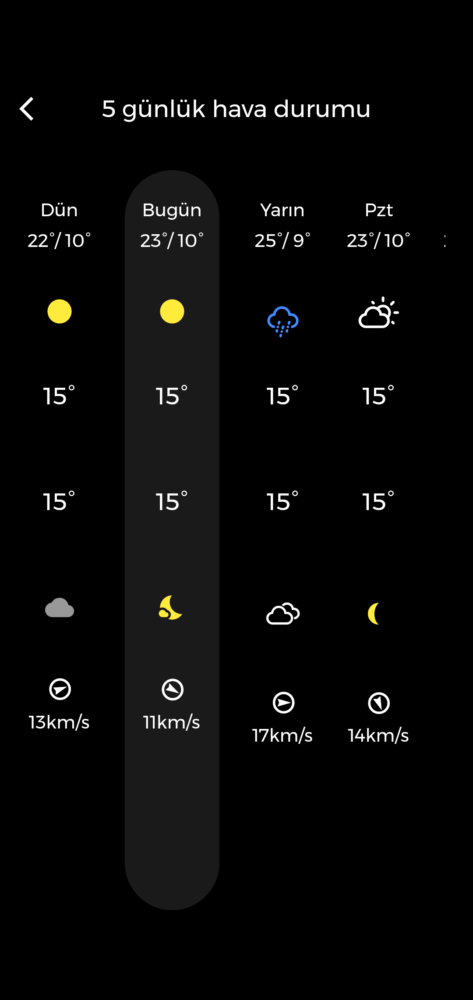
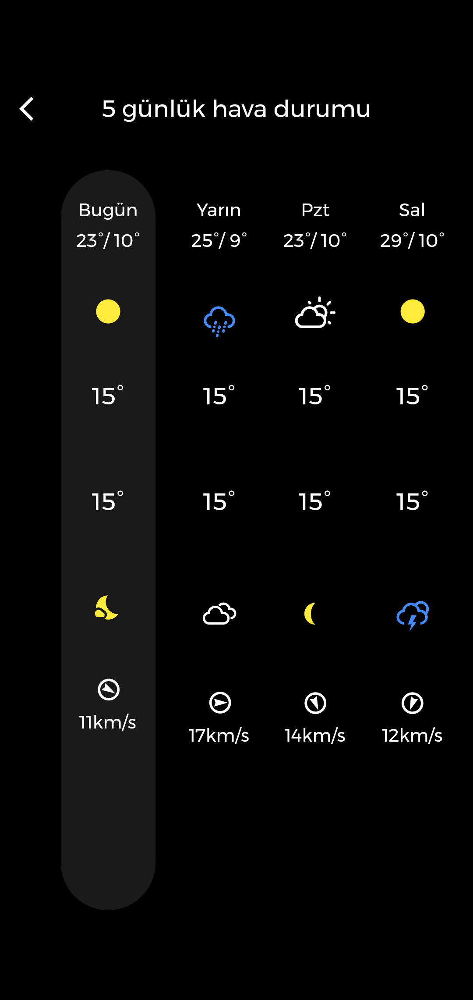

## Flutter Weather App
##### - In this project, i coded the weather app with Flutter. Also i used MVVM Design Pattern and Rest Api. The app is getting the weather data and the background gif from my readme file on github.

### My Application Design

   
     

### Technologies I used

##### -Flutter
##### -MVVM Design Pattern

